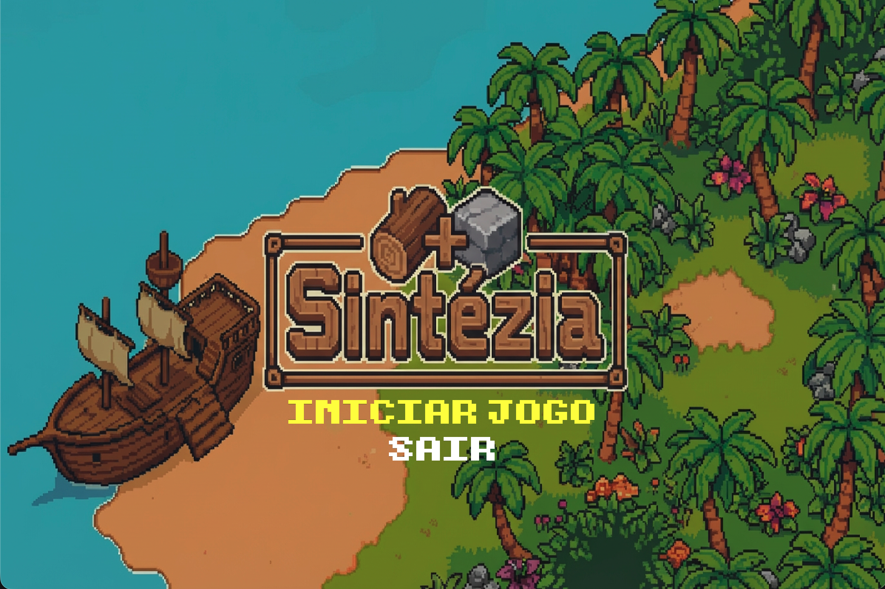
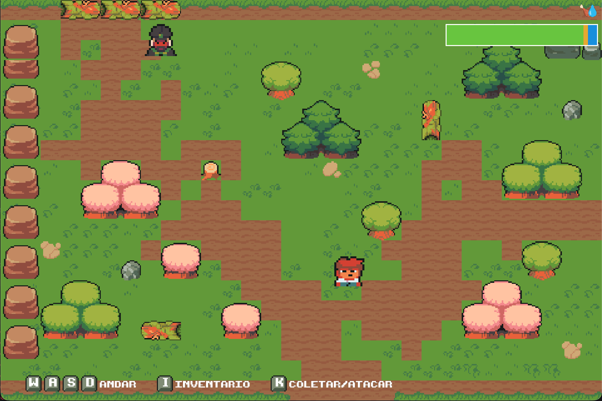
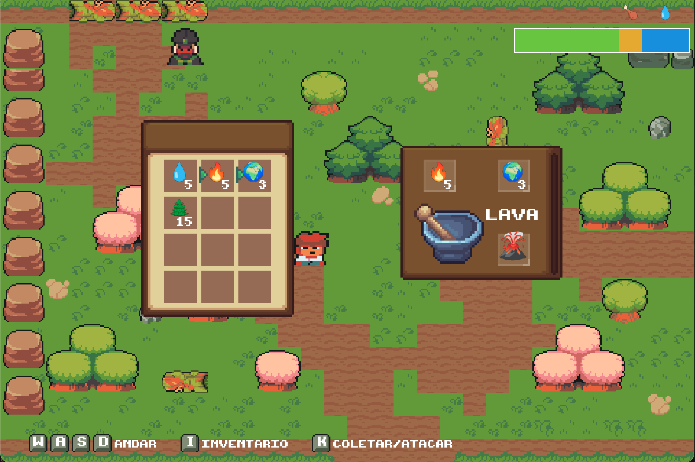
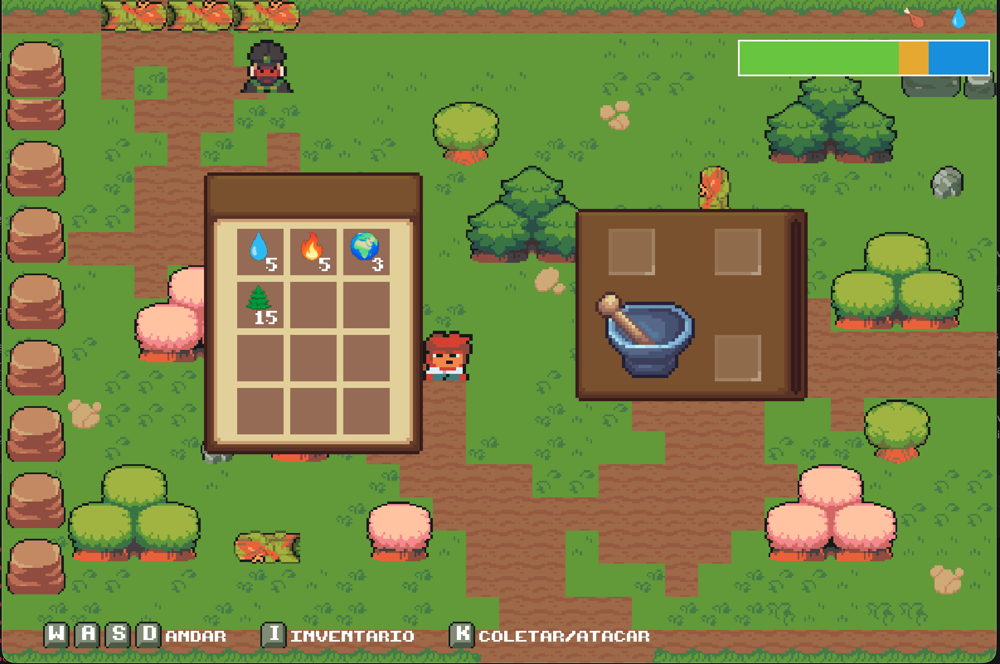
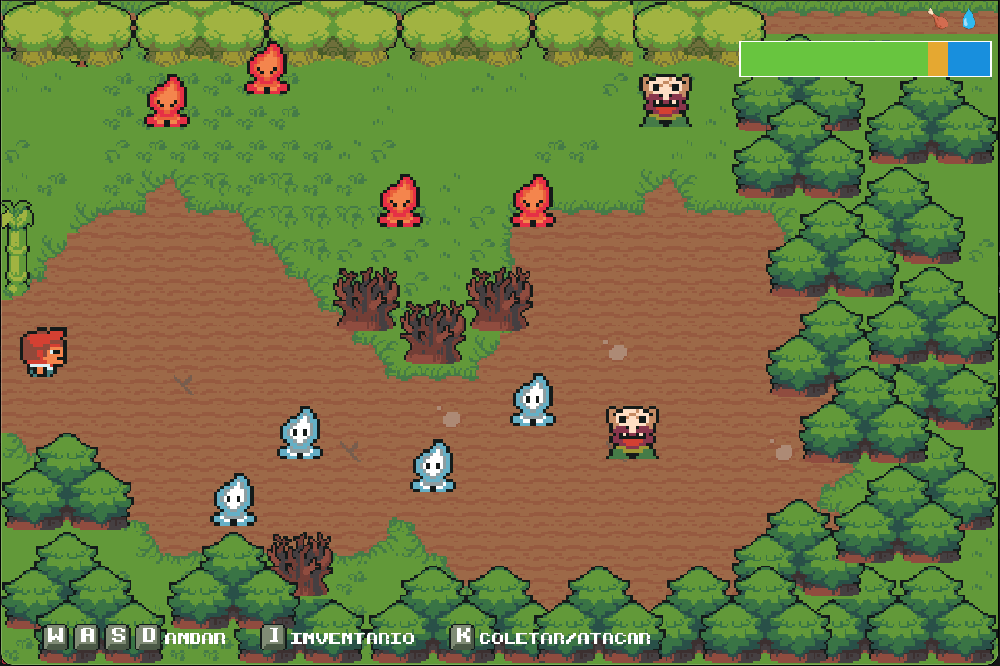
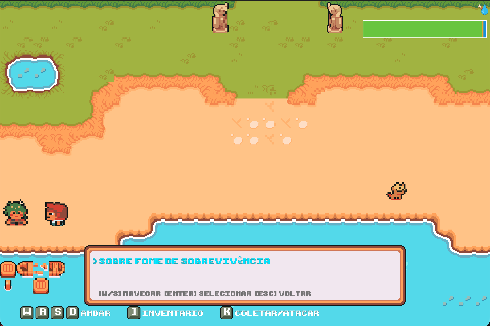
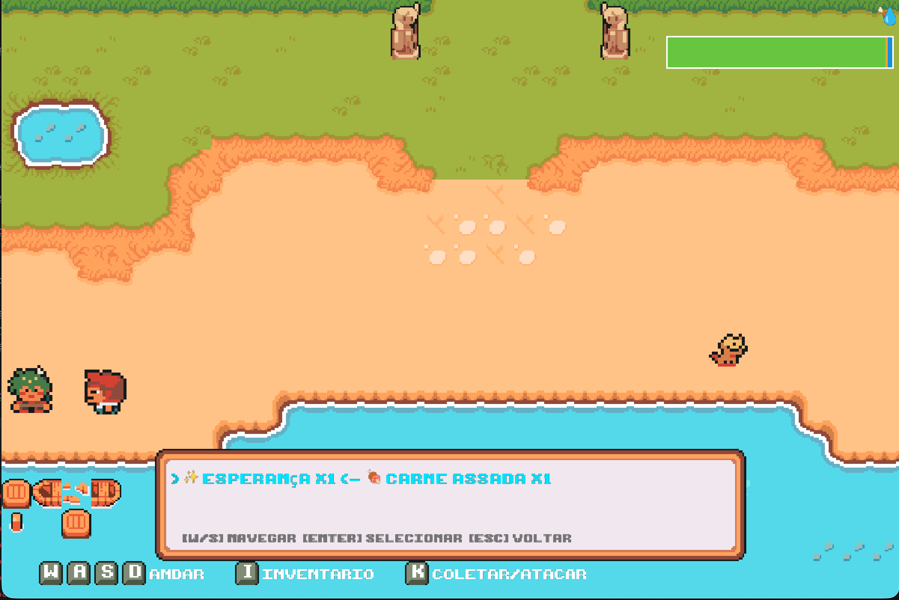

# Sintézia

## Screenshots
Abaixo estão capturas de tela representando os principais momentos e interfaces do jogo:

### Menu e Exploração

  
   

### Mecânicas Principais (Crafting e Inventário)

  
  

### Interações (Combate, Diálogos e Trocas)

  
  
  

---

## Descrição
**Sintézia** é um jogo de exploração e sobrevivência em 2D isométrico que convida o jogador a uma jornada introspectiva. O protagonista desperta naufragado em uma ilha misteriosa, sem memórias ou recursos, e deve encontrar formas de sobreviver. O diferencial do jogo está na fusão entre o concreto e o abstrato: a jogabilidade não se limita a combinar materiais físicos, mas convida o jogador a manipular a linguagem e ideias para criar ferramentas e conceitos essenciais para o progresso.

A mecânica central gira em torno da "sintetização". Inspirado em *Infinite Craft* e *Minecraft*, o jogador coleta elementos e os une para gerar novos itens (ex: Madeira + Pedra = Machado) ou conceitos (ex: Carne + Fogo = Carne Assada). O jogador deve gerenciar uma barra de vitalidade influenciada por quatro necessidades: fome, sede, peso e lesão. A sobrevivência exige um equilíbrio constante entre a criatividade da descoberta e a gestão arriscada de recursos limitados.

O objetivo final é reunir os meios necessários — literais e simbólicos — para escapar da ilha, como a criação da palavra "Barco". A vitória é alcançada ao deixar o local com vida, enquanto a derrota ocorre se a barra de vitalidade for preenchida pelas necessidades não atendidas ou se o personagem sucumbir aos perigos.

## Funcionalidades a serem testadas
Para esta build de playtesting, pedimos que os jogadores foquem sua atenção e feedback nas seguintes mecânicas implementadas:

1.  **Combate:** O sistema de confronto com ameaças está ativo. Pressione a tecla `[K]` para atacar os inimigos. *(Ver imagem: Images/10_Enemies.png)*
2.  **Diálogos:** O sistema de interação narrativa está funcional. Aproxime-se de um NPC e pressione `[SPACE]` para iniciar a conversa. Navegue pelo diálogo seguindo as dicas visuais na parte inferior do menu. *(Ver imagem: Images/5_Dialogs.png)*
3.  **Trocas:** Teste o fluxo de economia e escambo realizado através do menu de diálogos com os habitantes da ilha. *(Ver imagem: Images/8_Trade.png)*
4.  **Crafting:** A mecânica de criação de itens e conceitos está disponível. Abra o inventário com `[I]`, selecione a aba de crafting e experimente combinar diferentes elementos para descobrir novas receitas. *(Ver imagem: Images/12_Crafting.png)*

## Créditos
Este projeto foi desenvolvido como parte da disciplina de Desenvolvimento de Jogos.

* **Clara Costa:** Movimentação do personagem e Arte (Sprites).
* **Giovana Assis da Matta Machado:** Menu principal, HUDs e Sistema de barra de vitalidade.
* **Igor Joaquim da Silva Costa:** Mecânicas principais (Crafting), Inventário, Efeitos sonoros/Música, Roteiro (Quests/História) e Documentação.
* **Jorge Augusto:** Implementação de NPCs e Inimigos.
* **Vitor Emanuel:** Criação do Mapa e Level Design.

---
*Desenvolvido em C++ utilizando a biblioteca SDL2.*